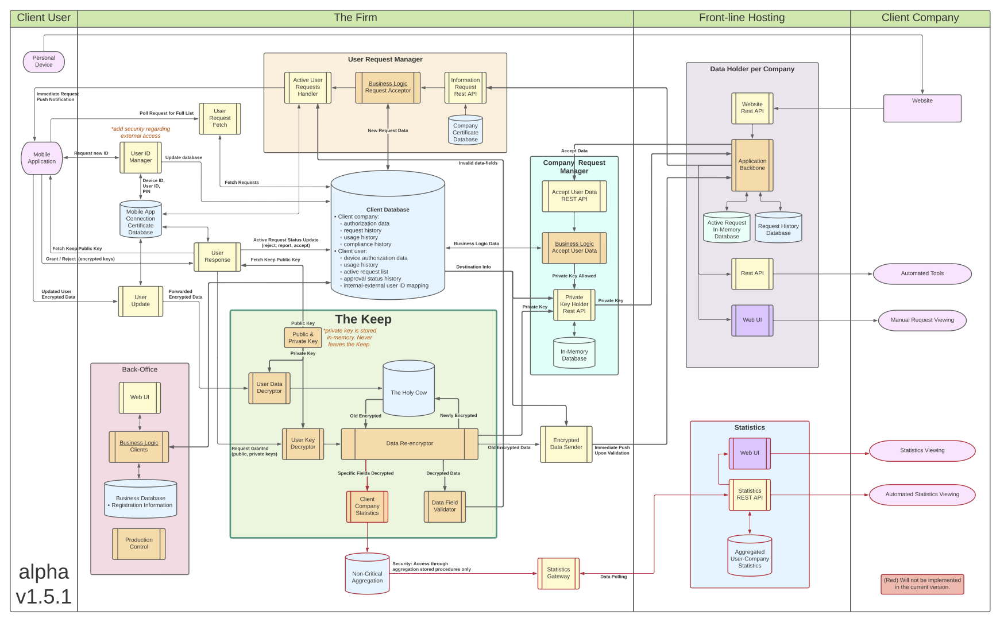
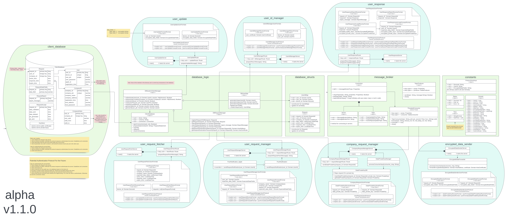

# KeepId Project
KeepId is a product for securely storing and sharing secrets from users to businesses. It aims to give full control and omniscience to the user about how their data is shared. KeepId's architecture also ensure that no one party involved in the system alone has the power to decrypt the user's secrets.

KeepId creates a secure secret sharing pipeline. Following the logic below, it ensures that secrets not involved in any sharing-transaction is ever at risk.
1. User uploads encrypted secrets to KeepId, while not sharing the private keys to unlock them.
2. User shares their assigned (non-secret) 6-digit PIN to companies whenever they wish to provide information about themselves.
3. Company can then utilize the user's PIN to request specific secrets from the user.
4. KeepId receives the secret-request and forwards it to the user.
5. User can approve the request, sharing only the private keys of the specific secrets it wishes to share about itself to KeepId.
    - By sharing only the keys of secrets they wish to share, it ensures that no other stored secret is at risk during this transaction.
    - User sends a new public key for each secret it shares, intended to re-encrypt the secret after the transaction to ensure it remains unknown to anyone at rest.
6. KeepId's server decrypt the selected secret with the provided user private keys and securly forwards the secrets to the company.
7. KeepId re-encrypts the stored secrets in its database with the new public key provided by the user.

# KeepId Repositories
- [KeepId-UserComms](https://github.com/MichaelLapshin/KeepId-UserComms) repository
  - Logical services, API services and storage volumes surrounding "The Keep".
  - Microservices are developed in Scala.
- [KeepId-TheKeep](https://github.com/MichaelLapshin/KeepId-TheKeep)
  - Repository for developing the most security-sensitive component in the project (a.k.a. "The Keep").
  - Contains logic and API related to encyption/decryption user stored secrets.
  - Defines database for storing the encrypted-secrets (i.e. the "Holy Cow").
  - Microservice developed in C++ with the database using NoSQL Cassandra.
- [KeepId-WebLib](https://github.com/MichaelLapshin/KeepId-WebLib)
  - Javascript library for websites to request secrets from a user given their 6-digit PIN.
  - Developed in HTML, Javascript and CSS.
- (private repository) KeepId-Deployer
  - Contains scripts, database schemas, secrets, and other deployment-related things.
- (private repository) KeepId-Website
  - KeepId's public website source code.
- (private repository) KeepId_App
  - KeepId's mobiel application source code.

# KeepId Architecture Overview


# KeepId-UserCommes UML Diagram 


## 
This project contains the source code for creating the services and storage volumes surrounding the keep.
The services are developed in Scala.

### Service Deployment
* Build the service images with `make`.
* Deploy the services through the `KeepId-Deployer` repository.

### Manual Deployment
* Compile all the services with the linux command `sbt clean compile assembly`.
* Create an image of a particular service by running docker build [path_to_service_dockerfile] -t [image_tag]`.
* Deploy an image with `docker run [image_name:tag]`.
* Deploy all the services with Kubernetes with command `kubectl apply -f [k8s_resources_file]`.

### Setup (deprecated, not applicable)
* Clone all KeepId repositories on the same level of a directory.
* Create a directory called "secrets" and create/import the following files with content:
  * 'credentials.yaml'
  ```
  credentials:
    comms-database:
      username: dbadmin
      password: [db_admin_password]
    the-keep-database:
      username: dbadmin
      password: [db_admin_password]
  ```
* Set the following environment variable:
  * `export KEEPID_SECRETS_DIR=/[path_to_secrets]/secrets`

### Deployment
* Run kubectl apply -f /[...]/KeepId-UserComms/k8s-resources-[prod|dev].yaml` to deploy kubernetes with the KeepId communication services.